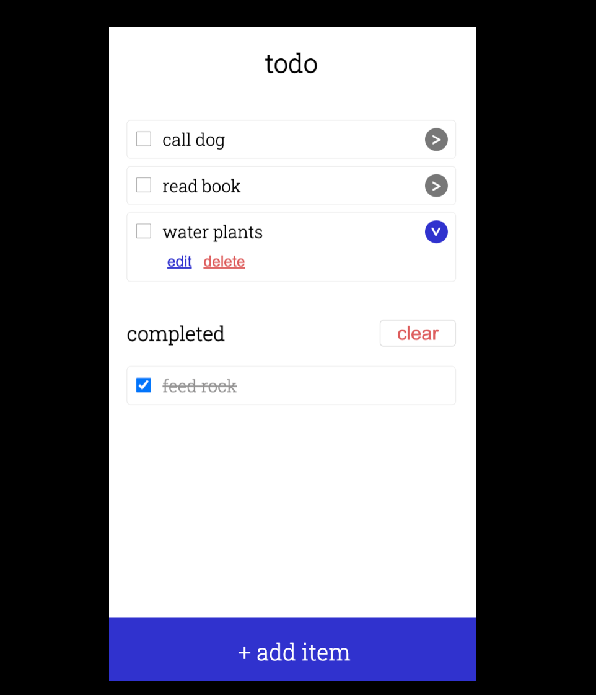
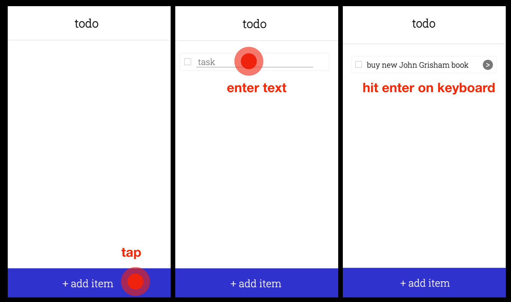
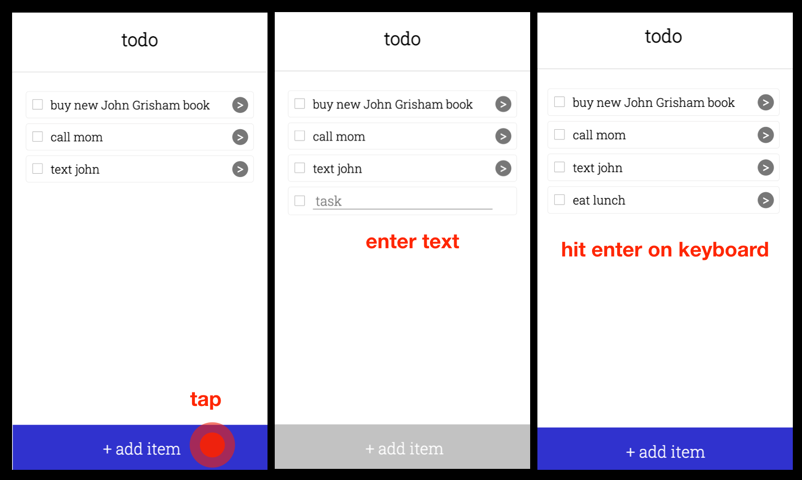
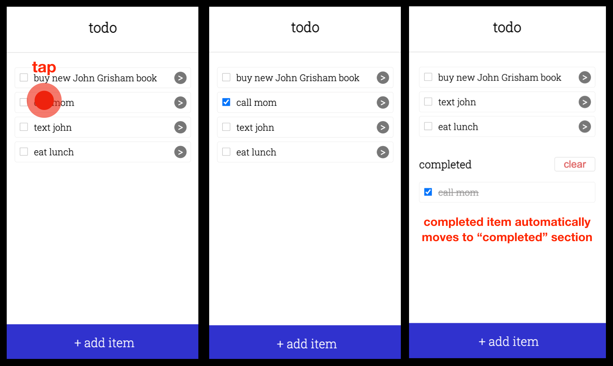
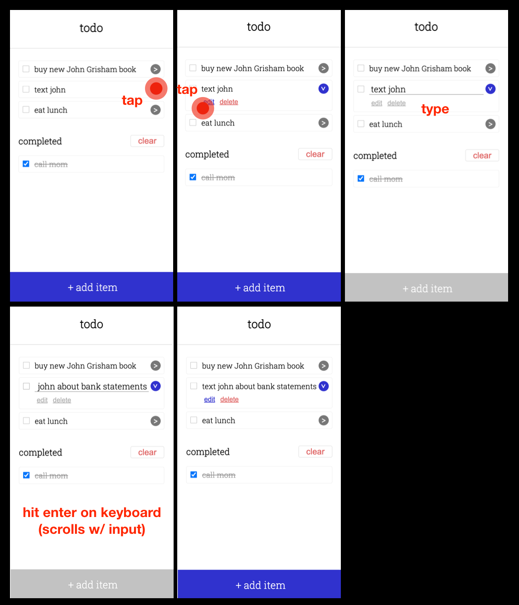
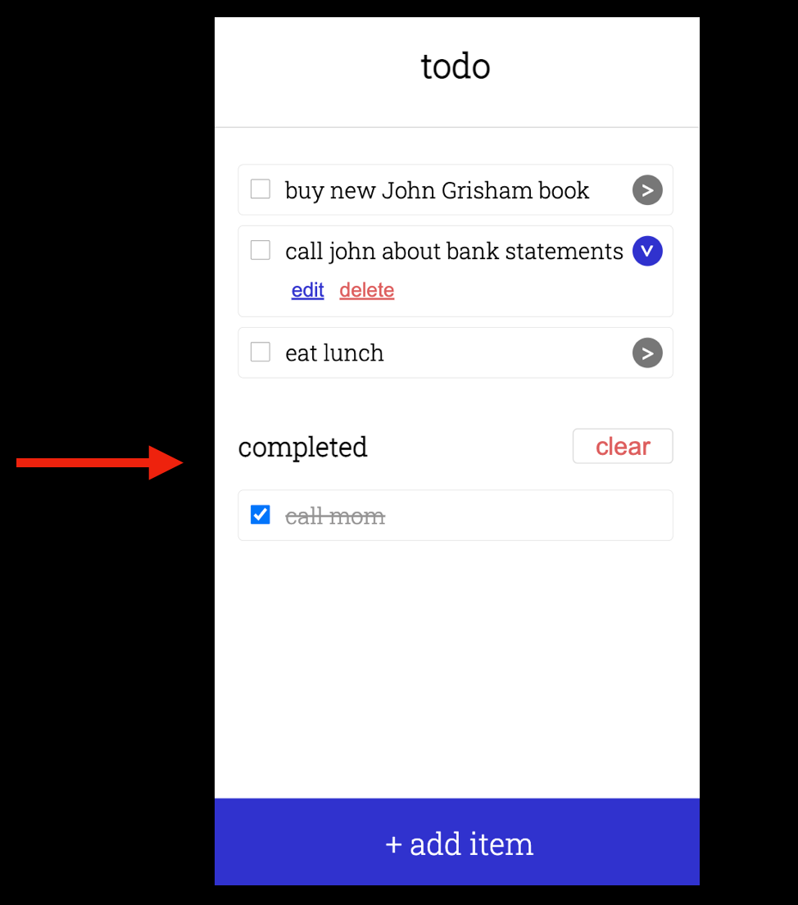
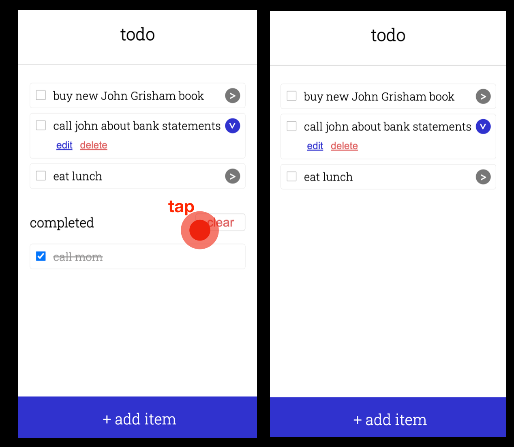

# CS 124 Lab 1: Design Doc

## Design decisions
Here are our design decisions.

## Alternative designs
Here are some alternative designs

## Final designs
The general idea of our final design can be seen in this "template" page we developed:

To avoid cluttering up each todo item with options (e.g. edit, delete), we placed them under a drop-down menu that will scale easily if more options are introduced.

### Add first item

To add an item, the user presses the `+ add item` button at the bottom of the screen, and a new task is immediately created. The task input field is immediately brought into focus so that the user can begin typing their todo, and the task is "solidified" once they hit `enter` on their keyboard.

### Add second item

The procedure for adding another item is exactly the same as adding the first.

### Mark item as completed

To mark an item as completed, the user taps on either the check box or the task text itself. The item stays in the todo list momentarily, and then moves itself into the `completed` section. This delay is to help the user see that their item has been marked completed before moving to another category (as opposed to instantly vanishing), but it should also be fast enough so that the user isn't surprised by the item spontaneously moving itself a few seconds later.

### Rename an item

To rename an item, the user taps the dropdown menu next to an item to reveal more options. They they tap the `edit` button, which brings the task text into focus and brings up the keyboard. In the meantime, the `edit` and `delete` buttons become temporarily disabled while the user types. When the user is finished, they hit `enter` on their keyboard to end the renaming and "solidify" the task again.

### Show all completed items

Completed items are shown by default so that users can easily see what they've finished so far.

### Clear all completed items

To clear all completed items, the user simply presses the `clear` button, which makes the completed items disappear.

## Challenges
Here are some challenges we faced

## Highlights
Here are the parts of the design we are most proud of