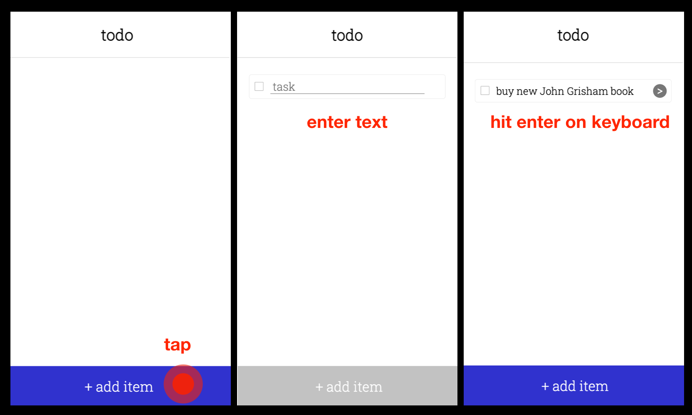

# CS 124 Lab 1: Design Doc

## Design decisions
We began thinking about the design by listing all of the things we knew
that the web app was going to need to do. We decided the best way was
to make it similar to how a hand-written to-do list might be designed.
Here is a very early sketch of what we thought that might look like.

From there we designed some more specifics about how to accomplish different tasks.
We decided that to add an item, we would place a button at the bottom
of the screen that would create a dummy item in an editing mode for the user
to add a button. By doing this, we thought it would be very clear both what
that button was for, and how to use it, since it is big, clearly labeled, and
in an appropriate location for a mobile app. To edit or delete items, we
didn't want those options to clutter up the main screen by being present for
all tasks at all times, but we still wanted to make it task specific, so
the user knows exactly what they are editing or deleting. So, we decided to
create a menu attached to each task. So, first the user selects to view
the menu, and then chooses the operation they want to perform. We chose
this menu to look like an arrow so that it would signal it was pressable,
and would provide a menu. For completed tasks, we decided that when the user
clicked the checkbox to complete a task, it would check the box, cross through
the task, and move it to a "completed" section. Here is an image of how we drew
out our main design to be before coding.

## Alternative designs
A few alternative designs we considered were related to the task edit and
deleted menus. We considered at one point using ellipses rather than an arrow
that rotated when opened or closed. We also considered having it come
in from the side, rather than be below the task, and have symbols rather than
words for the user to select the operation. Here's an image of what we thought
that might have looked like.

## Final designs
The general idea of our final design can be seen in this "template" page we developed:

To avoid cluttering up each todo item with options (e.g. edit, delete), we placed them under a drop-down menu that will scale easily if more options are introduced.

### Add first item

To add an item, the user presses the `+ add item` button at the bottom of the screen, and a new task is immediately created. The task input field is immediately brought into focus so that the user can begin typing their todo, and the task is "solidified" once they hit `enter` on their keyboard.

### Add second item

The procedure for adding another item is exactly the same as adding the first.

### Mark item as completed

To mark an item as completed, the user taps on either the check box or the task text itself. The item stays in the todo list momentarily, and then moves itself into the `completed` section. This delay is to help the user see that their item has been marked completed before moving to another category (as opposed to instantly vanishing), but it should also be fast enough so that the user isn't surprised by the item spontaneously moving itself a few seconds later.

### Rename an item

To rename an item, the user taps the dropdown menu next to an item to reveal more options. They they tap the `edit` button, which brings the task text into focus and brings up the keyboard. In the meantime, the `edit` and `delete` buttons become temporarily disabled while the user types. When the user is finished, they hit `enter` on their keyboard to end the renaming and "solidify" the task again.

### Show all completed items

Completed items are shown by default so that users can easily see what they've finished so far.

### Clear all completed items

To clear all completed items, the user simply presses the `clear` button, which makes the completed items disappear.

## Challenges
We had a few challenges when it came to the implementation of our design. In the
initial designs we had a decorative gray border on the sides, but it was more difficult
that anticipated to keep those in where their length wouldn't be dependent on the
number of tasks uncompleted. We eventually decided just to take those out. Getting
the arrows for the item menus to be styled correctly also took more time than we thought
it would initially. But most challenges we faced were small, and we problem-solved or changed
the design as needed.

## Highlights
In addition to (what we think is) a clean, uncluttered design, we think the method for adding todo items is the most in line with direct manipulation, since users can see their next item appear directly in the list of items without being confronted with a popup menu first. It also removes unnecessary ("20%") options that the user won't need most of the time so they can add that task off the top of their head as quickly and intuitively as possible.