# CS 124 Labs Design Doc

## Design decisions
We began thinking about the design by listing all of the things we knew
that the web app was going to need to do. We decided the best way was
to make it similar to how a hand-written to-do list might be designed.
Here is a very early sketch of what we thought that might look like.

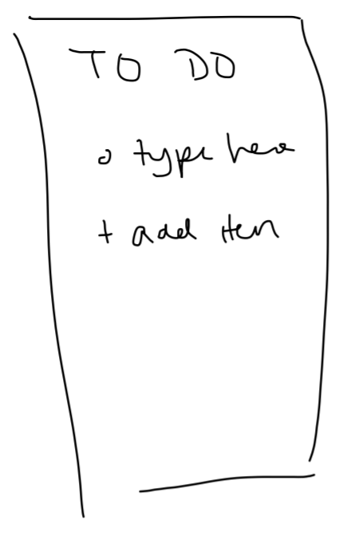

From there we designed some more specifics about how to accomplish different tasks.
We decided that to add an item, we would place a button at the bottom
of the screen that would create a dummy item in an editing mode for the user
to add a button. By doing this, we thought it would be very clear both what
that button was for, and how to use it, since it is big, clearly labeled, and
in an appropriate location for a mobile app. To edit or delete items, we
didn't want those options to clutter up the main screen by being present for
all tasks at all times, but we still wanted to make it task specific, so
the user knows exactly what they are editing or deleting. So, we decided to
create a menu attached to each task. So, first the user selects to view
the menu, and then chooses the operation they want to perform. We chose
this menu to look like an arrow so that it would signal it was pressable,
and would provide a menu. For completed tasks, we decided that when the user
clicked the checkbox to complete a task, it would check the box, cross through
the task, and move it to a "completed" section. Here is an image of how we drew
out our main design to be before coding.

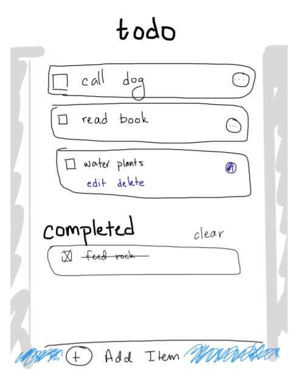

### Lab 2 Updates
After implementing our design as a React app, we made a few different and additional design choices.
One such choice was to use an arrow rather than a carrot for the menu drop-down. Another was to have items fade in and out as they appear, disappear, or relocate on the screen. Part of this design decision
was motivated by the desire to give the user immediate feedback when they check an item. So, when an item is marked as completed it immediately looks completed, and then there's a pause before it moves to the completed section.
We also added a button for if there are no tasks to complete, as an empty-task-placeholder, being able to click anywhere and have it exit the edit window.
Another design choice was how to handle long text in an item. What we decided to do was to set a character limit, and then afterwards it would elide the text. If the user clicks on the menu, then they can see the whole text, but then it would limit how much space an individual task can take up normally.

### Lab3 Updates
We made a few more design decisions in the process of implementing lab 3. When we created the priority functionality, we decided to add
those buttons in the drop-down menu with the edit and delete buttons, but have the user be able to view the priority of each task on a column to the left of each task,
leaving a task with no priority set blank. 

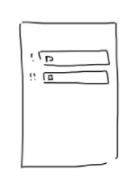

We gave these priority indicators colors to reflect the level of priority, and when the user
selects priority, it highlights the selected level with the same color. The user can select a new priority, or unselect to give the task no priority at all.
As part of the sorting, we gave the user a drop-down menu at the top to select how they want to sort the tasks, where the default is oldest-newest. The other
options are newest-oldest, alphabetical order, or priority. We couldn't decide whether oldest-newest or newest-oldest order would be better, so we just decided
to offer both since different users might find both helpful.

### Lab 4 Updates
In order to add capabilities for multiple lists, we decided to keep the actual functionality of the
lists exactly the same, but have a main page to hold all the lists.

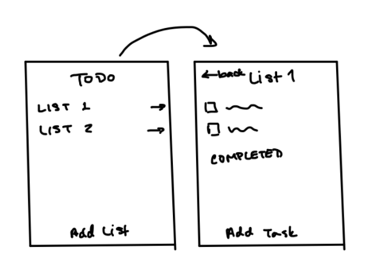

So, on the main view the user can see all of their lists, add a new list at the bottom where
the add task button was, delete lists, or go view the lists. Each list page is exactly the same
except that it now has the list name at the top instead of "todo" and has a back button
to go back to viewing all the lists. The other things we changed were for resizing and 
accessibility reasons. Notably, if the screen is large than the add item/list button changes from
spanning the entire bottom to a smaller round button in the lower right hand corner. We also changed
the priority buttons looked so that we wouldn't have a text contrast issue. So, the button choices just
have a different color for the selected priority and then outside the task there is a bullet point in 
red, orange, or yellow to indicate high, medium, or low priority.

## Alternative designs
A few alternative designs we considered were related to the task edit and
deleted menus. We considered at one point using ellipses rather than an arrow
that rotated when opened or closed. We also considered having it come
in from the side, rather than be below the task, and have symbols rather than
words for the user to select the operation. Here's an image of what we thought
that might have looked like.

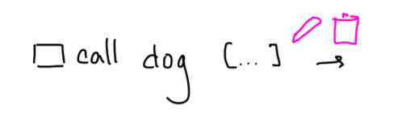

One alternative design for the priority was to have the priority indicators as part of the
task itself, but we though that it might make the task itself look cluttered and leave less room
for the task itself, so we went with the external indicator.

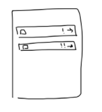

When we added the multiple lists capability we explored a few different options. One was to put
different lists on tabs like drawn below

We decided against that one because it didn't feel as intuitive, and we didn't want to style tabs. 
The other choice was to keep everything on one page, but have tasks underneath collapsible lists. 

This was the most intuitive, in our opinion, but was difficult to implement so we chose against it.

## Final designs
The general idea of our final design can be seen in this "template" page we developed:

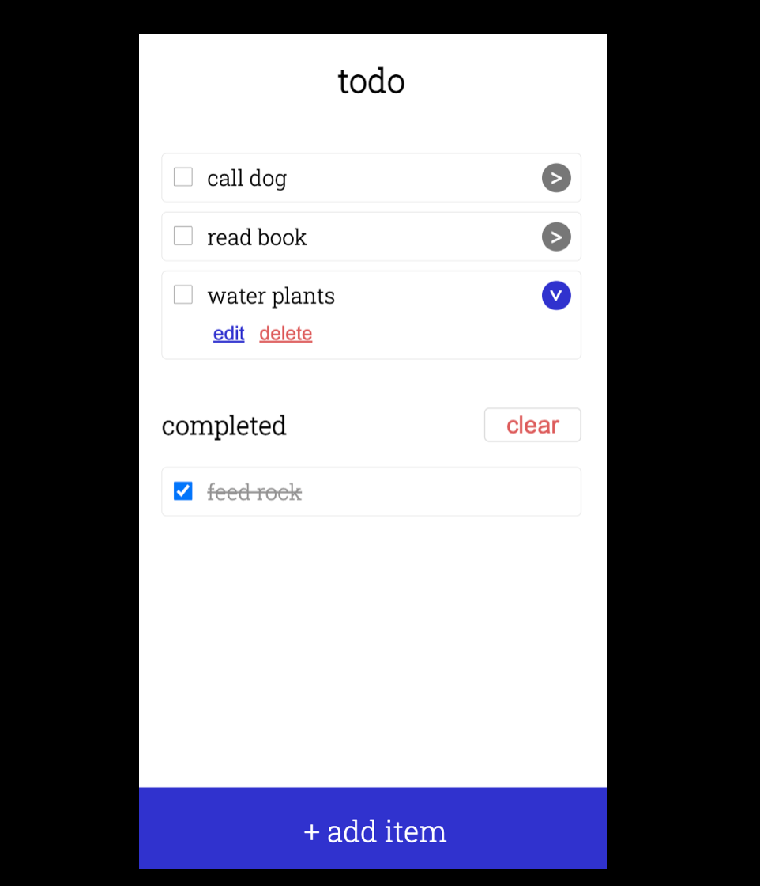

To avoid cluttering up each todo item with options (e.g. edit, delete), we placed them under a drop-down menu that will scale easily if more options are introduced.

### Add first item

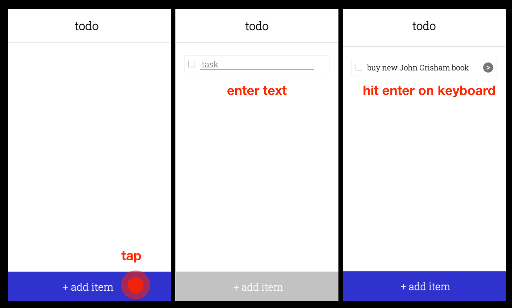

To add an item, the user presses the `+ add item` button at the bottom of the screen, and a new task is immediately created. The task input field is immediately brought into focus so that the user can begin typing their todo, and the task is "solidified" once they hit `enter` on their keyboard.

### Add second item

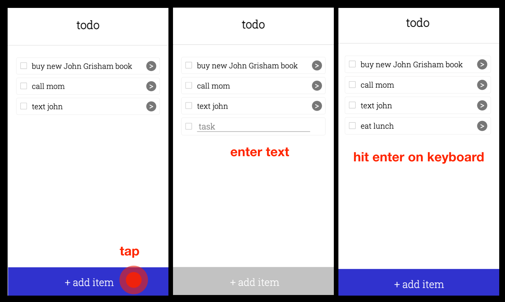

The procedure for adding another item is exactly the same as adding the first.

### Mark item as completed

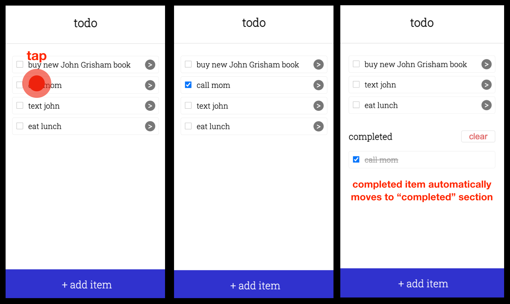

To mark an item as completed, the user taps on either the check box or the task text itself. The item stays in the todo list momentarily, and then moves itself into the `completed` section. This delay is to help the user see that their item has been marked completed before moving to another category (as opposed to instantly vanishing), but it should also be fast enough so that the user isn't surprised by the item spontaneously moving itself a few seconds later.

### Rename an item

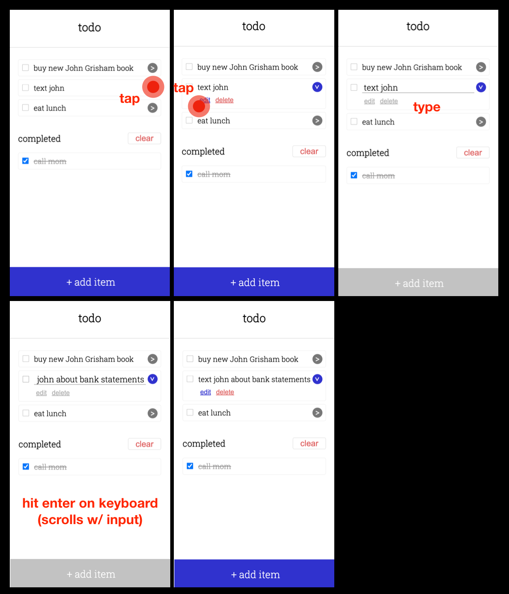

To rename an item, the user taps the dropdown menu next to an item to reveal more options. They they tap the `edit` button, which brings the task text into focus and brings up the keyboard. In the meantime, the `edit` and `delete` buttons become temporarily disabled while the user types. When the user is finished, they hit `enter` on their keyboard to end the renaming and "solidify" the task again.

### Show all completed items

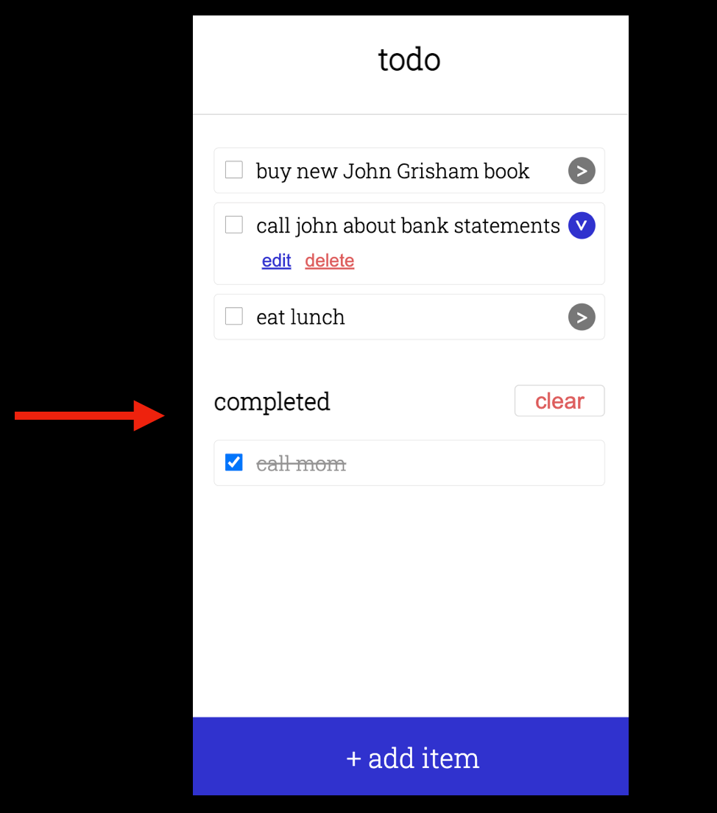

Completed items are shown by default so that users can easily see what they've finished so far.

### Clear all completed items

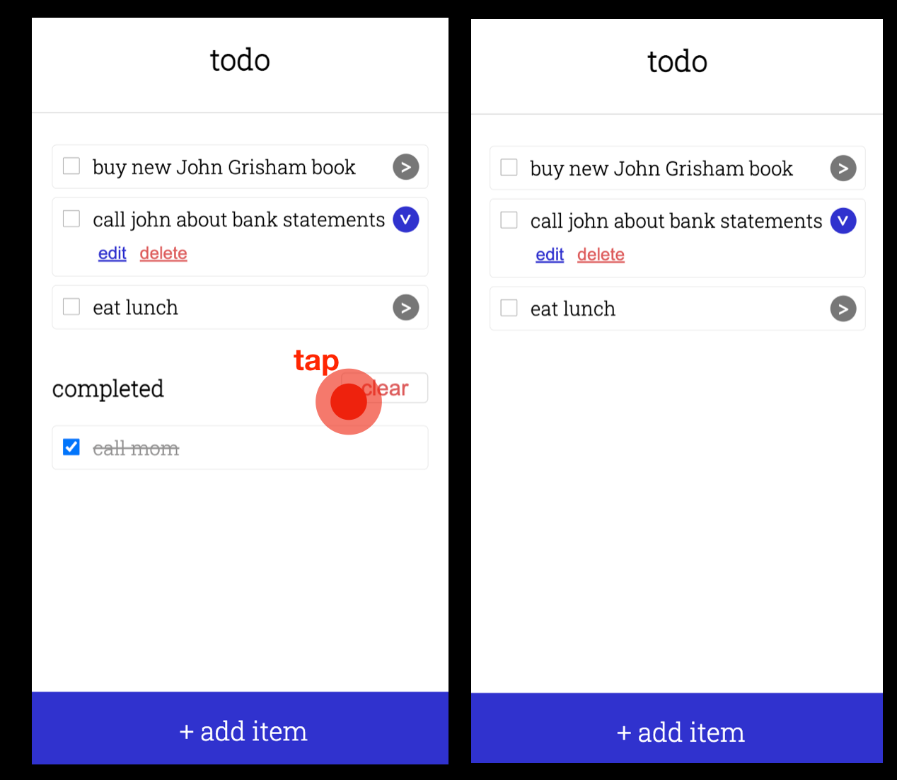

To clear all completed items, the user simply presses the `clear` button, which makes the completed items disappear.

## User Testing
We did our first round of user testing during lab3, using Marcos's roommate, Anshul. Anshul seemed to be mostly fluent using the app (including automatically hitting `Enter` to finish editing a task), but was visibly confused when he set the sorting mode to alphabetical and tried creating a task. As he typed, the task sorted itself, which was jarring to him. To fix this, we found a way to preserve sorting order when editing a task, which is outlined in the `Challenges` section below.

## Challenges
### Lab 2
One challenge was when we made the React app and had to figure out how to work with memory and storing the data, and then figuring out how to change it. We initially changed the initial data and then re-rendered the page, but we moved it into states instead so we don't change the data itself, instead changing the state and creating new data for the re-render.

### Lab 3
One challenge we encountered at this step was when we implemented task sorting. We had to figure out whether it was better to sort as we pulled from Firestore, or if we wanted to sort with the already-pulled data. We ultimately went with the latter because we thought seeing the loading panel each time the user changed sorting method was a little jarring. We also struggled trying to prevent tasks from rearranging themselves when adding or editing a task when sorting by alphabetical order; it's very unpleasant to try to type while your text box is moving around. We knew we wanted to preserve the sort order while the user edits a task, but it took a while to figure out the "React way" of doing this. Including whether a task is in edit mode in the database didn't seem right, and neither did create another component for a task in edit mode that then had to re-merge with the other tasks. Ultimately, we moved the `taskInEditModeId` state up to where tasks are sorted, and added a bit of extra logic to save a "frozen" version of a task if it is in edit mode (the state of the task before any edits). Then, when sorting, if an element is in edit mode, it actually uses the frozen version to compare against other elements, preventing the "auto-sort" issue.

### Lab 4
We had a few challenges in this lab. One was making our own database, and having everything re-render properly. We also had some difficulties when adding accessibility and had to re-design some things - like the priority indicators. We also had some problems with deleting tasks, but some of those things fixed themselves.
The biggest challenge was actually choosing the design implementation of the multiple lists, and ended up having to go with an easier design choice because the collapsible lists was proving to be difficult.

## Highlights
In addition to (what we think is) a clean, uncluttered design, we think the method for adding todo items is the most in line with direct manipulation, since users can see their next item appear directly in the list of items without being confronted with a popup menu first. It also removes unnecessary ("20%") options that the user won't need most of the time so they can add that task off the top of their head as quickly and intuitively as possible.
We're also very proud of how when the user checks an item, it fades out before moving to the completed section. We believe it to be a nice usability touch, and nicely implemented.
